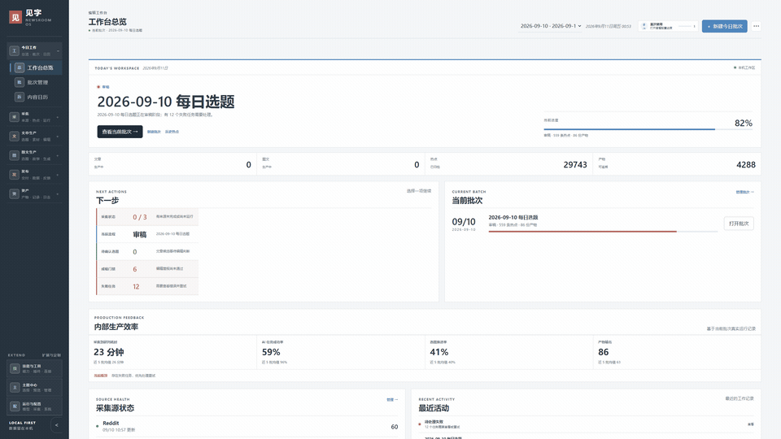
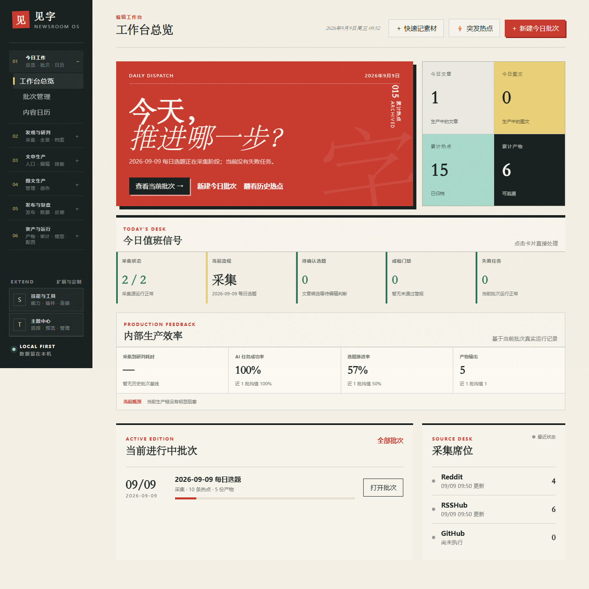
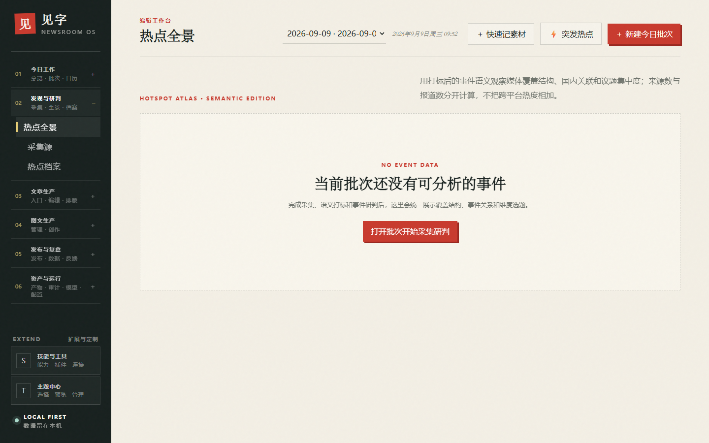
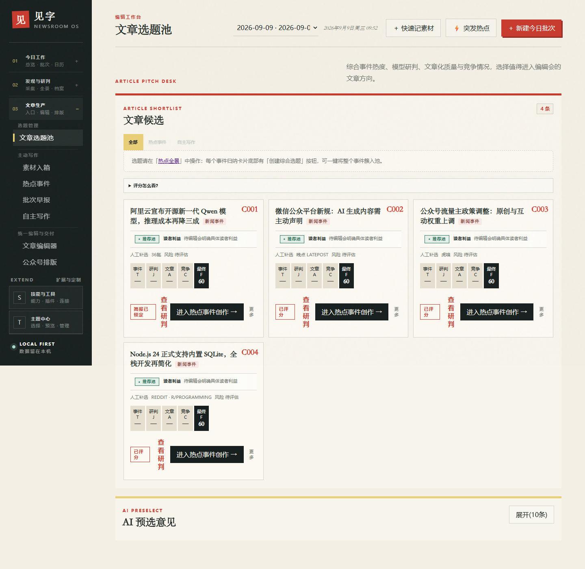
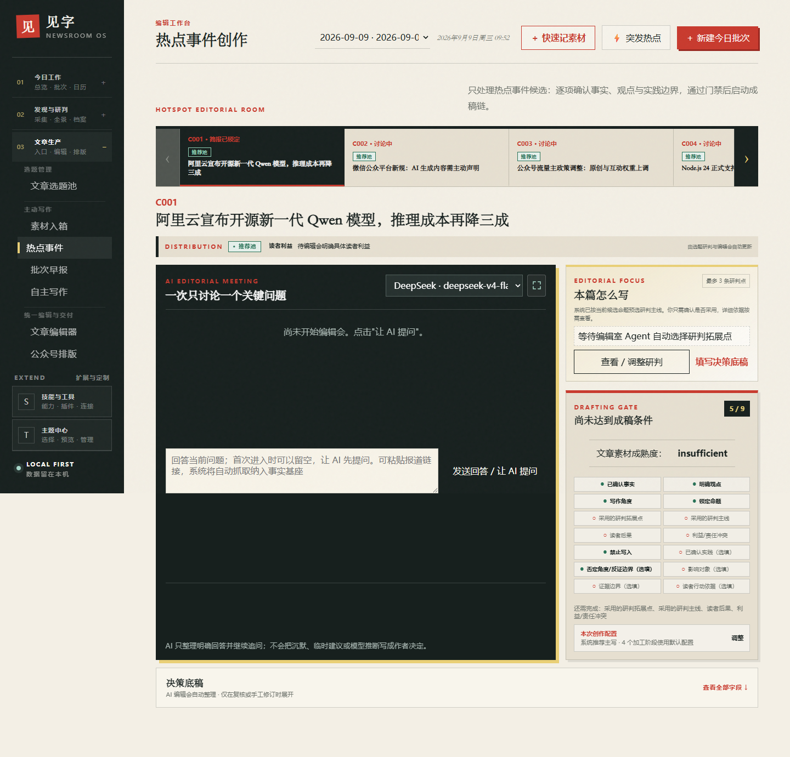
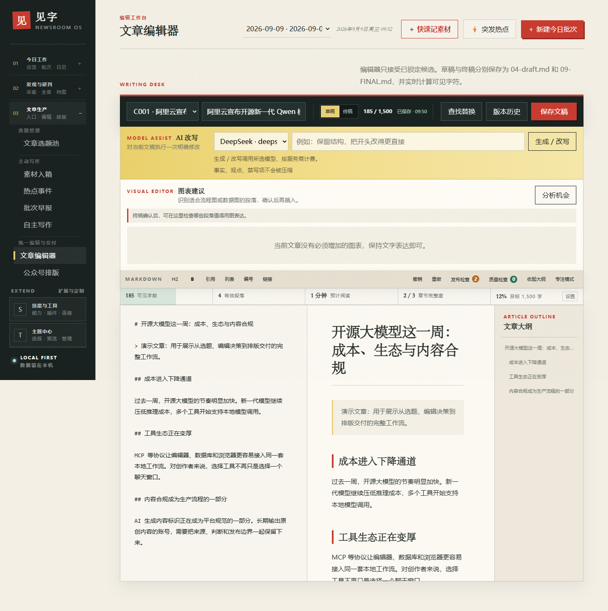
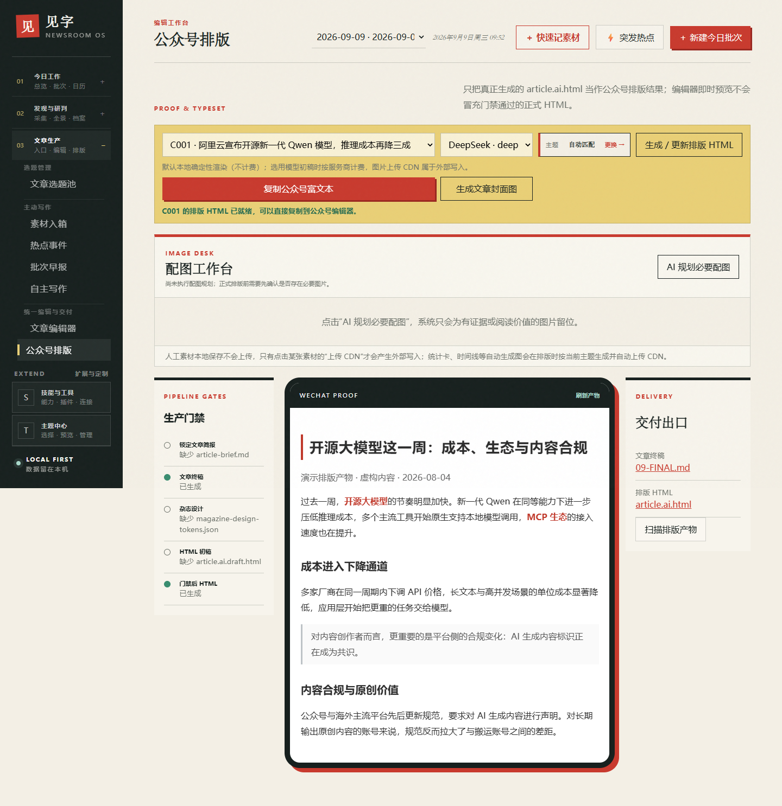
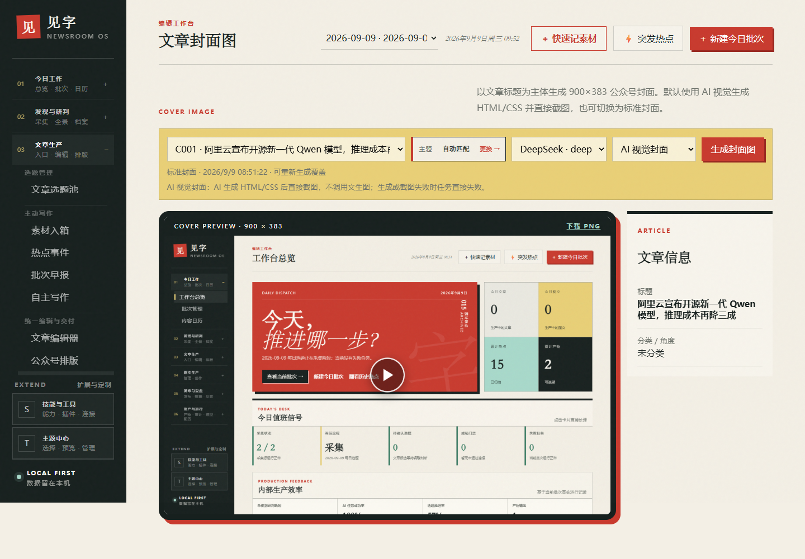
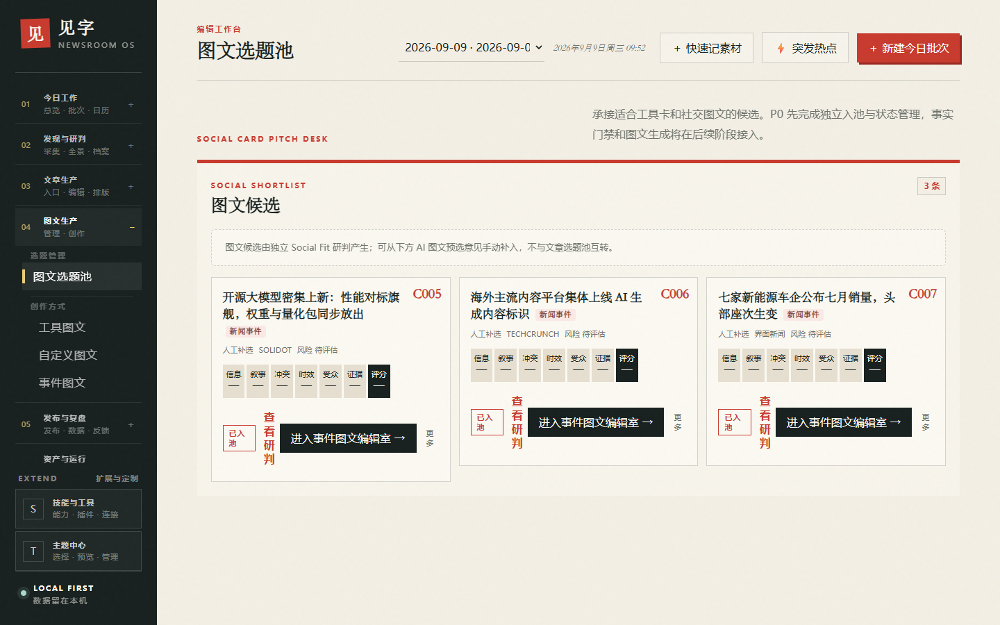

# 见字 · WeChat AI Newsroom

[中文](./README.md) · [English](./README.en.md)

> **A local-first AI newsroom for WeChat creators — research, topic discovery, writing, review, formatting, and visual production.**
>
> Start with a source or a story, then move from research to an editorial decision, a reviewed draft, WeChat-ready HTML, a cover, and social cards.

[](./LICENSE)
[](https://github.com/shiker1996/wechat-newsroom-workbench/actions/workflows/ci.yml)
[](./package.json)

<p align="center">
  
</p>

<p align="center">⭐ If this workflow is useful to you, please Star the project or tell us which source you want to connect next.</p>

<p align="center">
  
  
  
</p>
<p align="center">
  
  
  
</p>
<p align="center">
  
  
</p>

The GIF and screenshots are generated from demo mode. Regenerate the GIF with:

```bash
node scripts/media/render-demo-gif.mjs
```

## What problem does it solve?

A typical content workflow jumps between RSS or search, a chat model, fact checking, a separate editor, and a design tool. Sources, decisions, drafts, and final assets become difficult to trace.

见字 keeps the workflow in one local workbench:

```text
Sources → Hotspots → Events & facts → Candidate topics
        → Editorial decision → Article / social content
        → WeChat formatting and deliverables
```

The core idea is not just “generate an article”. Each stage keeps its inputs, decisions, versions, and outputs so that you can continue, verify, and review the work later.

## Why not ChatGPT plus a WeChat editor?

ChatGPT and other editors can still be part of your workflow. 见字 focuses on the missing editorial layer between them.

| | Typical tool combination | 见字 |
|---|---|---|
| Starting point | Enter a topic | Start from sources, hotspots, or your own material |
| Editorial reasoning | Scattered across chats and memory | Events, fact cards, candidate topics, and briefs stay structured |
| Delivery | Copy and paste between tools | Articles, WeChat HTML, covers, and social cards share one cabinet |
| Retrospective | Files and chat history are hard to connect | Versions, runs, and failure reasons are traceable |

## Quick start

### Prerequisites

- Node.js 24 or newer
- An OpenAI-compatible model service for AI actions; demo mode can be explored without one
- Windows 10/11 is the primary validated platform

### Run the demo in under a minute

```bash
git clone https://github.com/shiker1996/wechat-newsroom-workbench.git
cd wechat-newsroom-workbench
npm install
npm start -- --demo
```

Then open `http://127.0.0.1:4317`. Demo mode uses a separate `data/demo.db` and does not change your normal workspace data. For a reproducible lockfile install, use `npm ci` instead of `npm install`.

To inspect the latest real production batch locally, opt in explicitly:

```powershell
npm start -- --demo --demo-production
# Windows launcher: start-workbench.cmd -DemoProduction -NoBrowser
```

This creates an independent `data/demo-production.db` snapshot from `data/workbench.db` and makes the HTTP API read-only. It never writes back to the production database. Production content is for local inspection only; do not use this mode to create public screenshots or GIFs.

### Start a real workspace

```bash
npm run setup
npm start
```

The setup wizard helps configure the local workspace and model providers. On Windows, you can also run `setup-workbench.cmd` and then `start-workbench.cmd`.

## Main capabilities

| Stage | Capabilities |
|---|---|
| Research | RSS / Atom, RSSHub, Reddit, GitHub discovery, static and browser-assisted web collection |
| Analysis | Hotspot labels, event clustering, fact cards, China-audience relevance, article and social topic pools |
| Editorial | Conversational editorial meetings, source supplementation, author-practice gates, deduplication, and structured briefs |
| Writing | Type-specific drafts, titles, AI cleanup, review, SEO, word-count and fact gates, versioned revisions |
| Delivery | WeChat HTML formatting, preview, 900×383 covers, Mermaid / ECharts rendering, and paged social PNGs |
| Operations | Skills, plugins, dynamic configuration, capability routing, audit logs, Run Trace, backup and restore |

## Recommended first workflow

1. Add and test an OpenAI-compatible model under “运行与配置 → 模型接入”.
2. Add RSS, Reddit, or web sources and run a preview first.
3. Create a batch and run collection, labeling, event cards, and analysis.
4. Select a candidate topic and complete the editorial decision and fact confirmation.
5. Generate the article, WeChat formatting, cover, or social deliverables.

See the [user guide](./docs/user-guide.md) for page-by-page instructions, profiles, backups, and troubleshooting.

## Data and security boundaries

见字 is a local-first workbench, not a hosted multi-user SaaS. The local service listens on `127.0.0.1` by default. Workspace data and run records stay local unless a configured model, search, collection, or image service needs the relevant task input.

The application is intended for a trusted local user. It does not currently provide the authentication, CSRF protection, or multi-user authorization needed for public deployment. AI output still requires human review for facts, sources, copyright, and publishing risk.

## Support matrix

| Platform | Status | Notes |
|---|---|---|
| Windows 10/11 | ✅ Fully validated | Recommended platform; launcher and demo mode are verified |
| macOS | 🧪 Experimental | Launcher is included; not yet maintainer-validated |
| Linux | 🧪 Experimental | Launcher is included; not yet maintainer-validated |

## Development

```bash
npm ci
npm run build
npm run test:fast
```

Useful documentation:

- [Documentation index](./docs/README.md)
- [Configuration reference](./docs/configuration.md)
- [Plugin development](./docs/plugin-development.md)
- [Architecture overview](./docs/architecture.md)
- [Security boundary](./SECURITY.md)
- [Release, upgrade, and recovery](./docs/release.md)

## License

Code is released under the [MIT License](./LICENSE). Third-party materials and licenses are listed in [THIRD_PARTY_NOTICES.md](./THIRD_PARTY_NOTICES.md).
